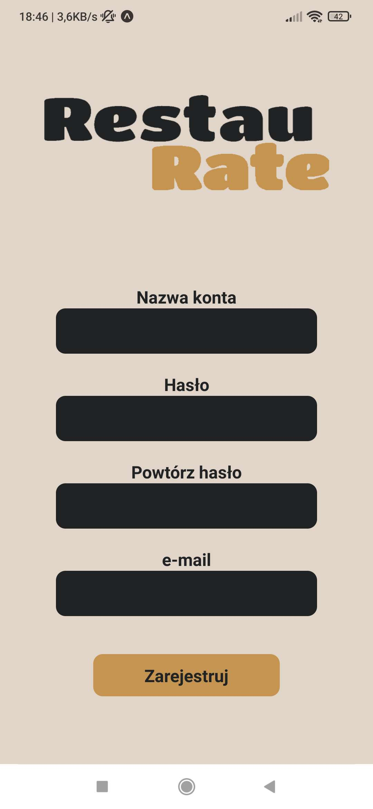
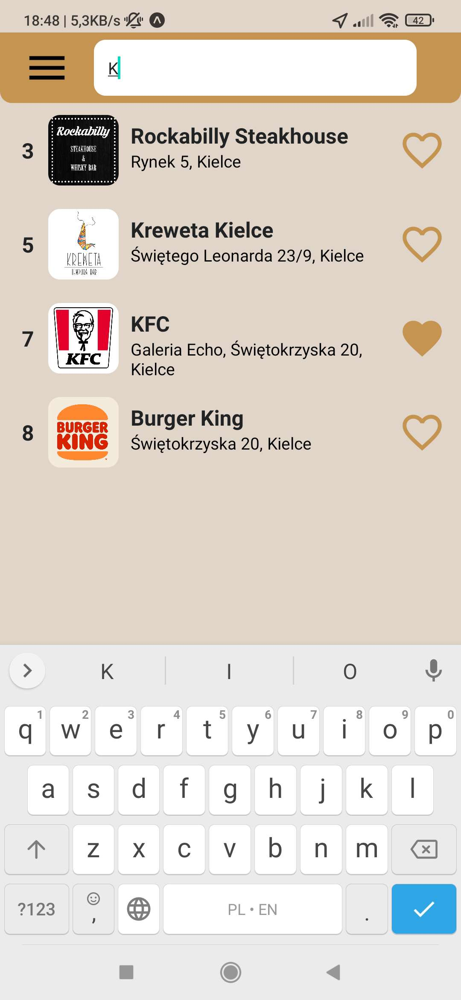

# RestauRate

Aplikacja mobilna umożliwiająca wyszukiwanie i ocenianie restauracji.  
Użytkownicy mogą dodawać opinie, czytać opinie innych, dodawać restauracje do ulubionych i korzystać z mapy Google, aby znaleźć najbliższe miejsca.  
Wyszukiwanie jest możliwe zarówno po nazwie restauracji, jak i poprzez lokalizację.

---

## Funkcjonalność

- logowanie, rejestracja, wylogowanie  
- wyszukiwanie restauracji w pobliżu na mapie  
- dodawanie i wyświetlanie ulubionych restauracji  
- przeglądanie wszystkich restauracji i filtrowanie po nazwie  
- wyświetlanie opisów i opinii  
- dodawanie opinii (z możliwością dodania zdjęcia)  
- zmiana hasła konta  

---

## Zrzuty ekranu

### Ekran logowania i rejestracji

  
  
  

---

### Menu główne

---

### Wyszukiwanie i mapa

  
  

---

### Ulubione restauracje

---

### Szczegóły restauracji, dodawanie opini i kamera

  
  
  

---

### Ustawienia i zmiana hasła

  
  

---

### Menu boczne (drawer)

